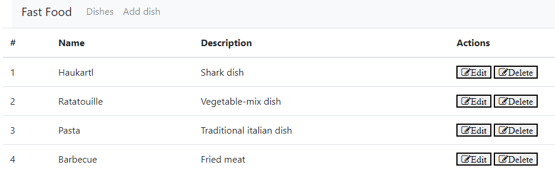
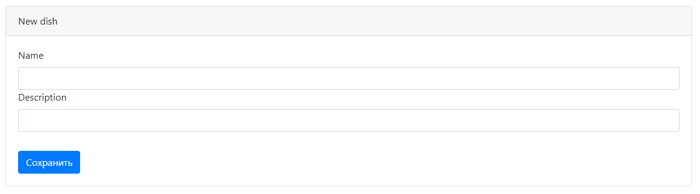
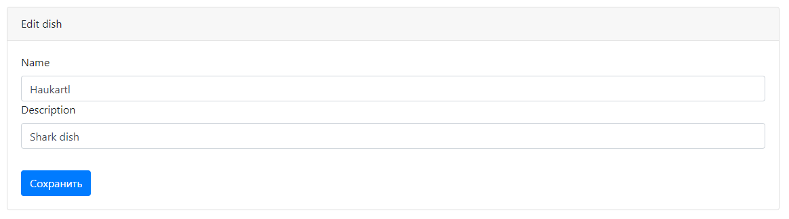
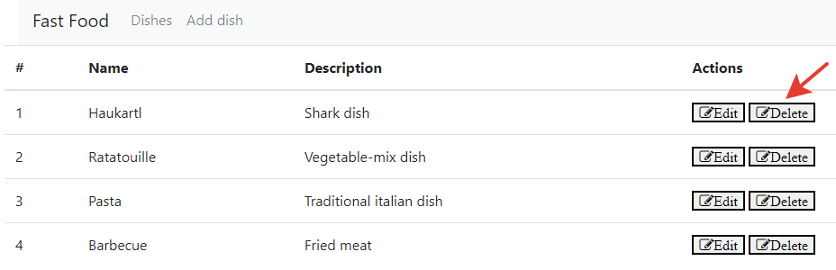

# job4j_admin

## Описание
Данное приложение наряду с job4j_dish является частью проекта по управлению списком блюд.  
Этот микросервис обрабатывает входящие запросы браузера, делает REST запросы к микросервису job4j_dish
и возвращает результаты в виде представления.

## Стек технологий
* Java 17
* PostgreSQL 14
* Apache Maven 3.8.5
* Spring Boot 2.7.10
* Liquibase 4.9.1
* Lombok 1.18.26
* JUnit 5.8.2
* Mockito 4.5.1
* Checkstyle 10.7.0
* Thymeleaf 3.0.15

## Требуемое окружение для запуска проекта
* Браузер
* JDK 17
* Apache Maven 3.8
* PostgreSQL 14

## Инструкция по запуску проекта
1) Скачать и разархивировать проект
2) Открыть командную строку и перейти в папку с проектом, например `cd c:\projects\job4j_admin`
3) Выполнить команду `mvn install`
4) Перейти в папку target командой `cd target`
5) Выполнить команду `java -jar job4j_admin-0.0.1-SNAPSHOT.jar`

## Взаимодействие с приложением

### При открытии сайта попадаем на главную страницу со списком блюд, на которой указаны возможные действия

### С главной страницы можно пройти по кнопке **Add dish**, чтобы создать новое блюдо

### Есть возможность скорректировать блюдо через кнопку **Edit**

### Или удалить блюдо кнопкой **Delete**

## Контакты для связи
&nbsp;&nbsp;
&nbsp;&nbsp;